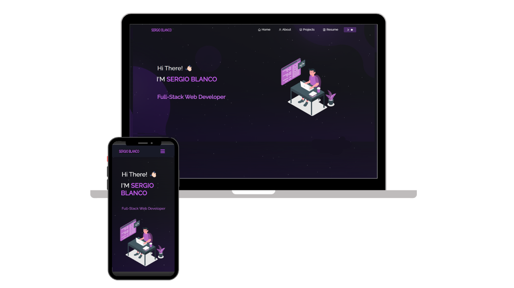

<h2 align="center">
  Portfolio Website - v2.0 
  <a href="#" target="_blank">Sergio Blanco</a>
</h2>

  

 

## TL;DR

This project was built using these technologies.

## Features

**📖 Multi-Page Layout**

**🎨 Styled with React-Bootstrap and Css with easy to customize colors**

**📱 Fully Responsive**

## Getting Started

Clone down this repository. You will need `node.js` and `git` installed globally on your machine.

## 🛠 Installation and Setup Instructions

1. Installation: `npm install`

2. In the project directory, you can run: `npm start`

Runs the app in the development mode.\
Open [http://localhost:3000](http://localhost:3000) to view it in the browser.
The page will reload if you make edits.

## Usage Instructions

Open the project folder and Navigate to `/src/components/`.  
You will find all the components used and you can edit your information accordingly.

## Deploy
(https://portafolio-sergioblaord7.vercel.app/)https://portafolio-sergioblaord7.vercel.app/

